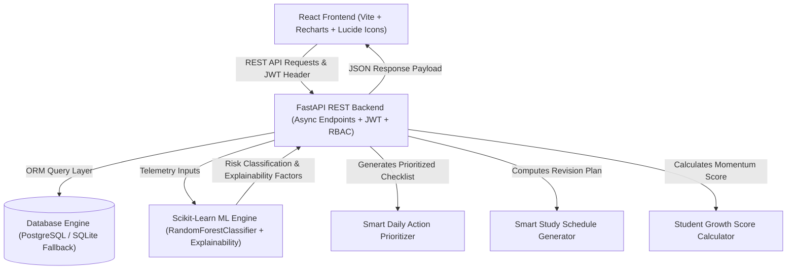
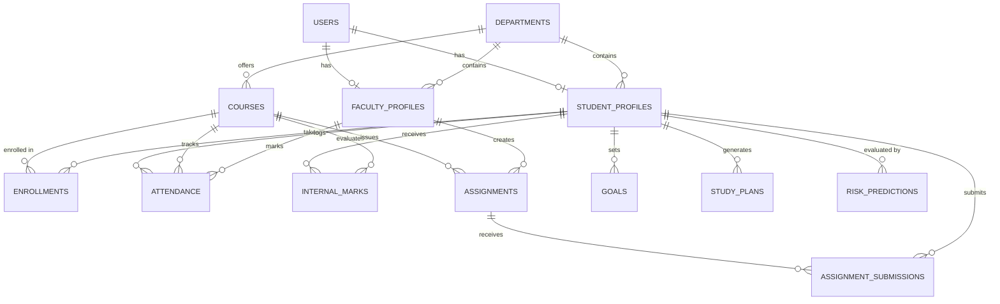

# CampusFlow — Smart College Student & Academic Management Platform

<div align="center">

[](https://fastapi.tiangolo.com/)
[](https://reactjs.org/)
[](https://vitejs.dev/)
[](https://scikit-learn.org/)
[](https://python.org)
[](LICENSE)

**An intelligent, multi-tenant higher education SaaS platform unifying academic operations with machine-learning-driven telemetry, automated daily prioritization, dynamic study scheduling, and transparent momentum scoring.**

[Key Features](#-key-features) • [User Roles](#-user-roles) • [System Architecture](#-system-architecture) • [Installation & Setup](#-installation--setup) • [Demo Accounts](#-demo-accounts)

</div>

---

## 📖 Project Overview

### Problem Statement
In traditional higher education institutions, academic tracking is heavily fragmented:
- **Scattered Academic Data**: Attendance records, continuous assessment marks, assignment submission deadlines, and exam schedules reside in isolated portals or physical registers.
- **Delayed Intervention**: Students and faculty only realize academic distress after semester-end results are published when remediation is difficult.
- **Lack of Actionable Daily Direction**: Students struggle to prioritize overlapping deadlines and examination preparations across multi-credit engineering subjects.
- **Administrative Blindspots**: Department heads and deans lack real-time visibility into cross-department academic risk distribution and faculty grading throughput.

### The Solution: CampusFlow
**CampusFlow** bridges operational management with academic intelligence. It is engineered as a modern, reactive SaaS application that provides real-time academic telemetry:
1. **Predictive Support**: Detects at-risk trajectories before midterm milestones using a trained Machine Learning classifier.
2. **Actionable Guidance**: Translates complex academic status into an automated, prioritized daily checklist.
3. **Adaptive Planning**: Dynamically generates personalized study schedules calibrated against course credits and self-reported difficulty.
4. **Transparent Momentum**: Quantifies ongoing academic performance using a multi-factor Growth Score.

---

## 🌟 Key Features

### 1. 🤖 Smart Academic Risk Detection (ML-Powered)
- **Model Engine**: Scikit-Learn `RandomForestClassifier` trained on synthetic telemetry profiles.
- **Features Evaluated**: Attendance %, Average Internal Marks %, Assignment Completion %, Historical GPA, Overdue Assignments Count, Weekly Study Hours, and Performance Trajectory Delta.
- **Explainable AI Callouts**: Generates human-readable explanations detailing the precise root causes behind a risk prediction (e.g., *"Overall attendance is 62.0% (Below 75% threshold)"*, *"3 overdue assignments require immediate submission"*).
- **Constructive Framing**: Designed as an **Academic Support Indicator** to facilitate early intervention and mentorship.

### 2. ⚡ Smart Daily Action Prioritizer ("What Should I Do Today?")
- Analyzes active deadlines, pending submissions, low attendance warnings, and upcoming examinations.
- Formulates a weighted checklist categorized into High, Medium, and Normal priority tiers.
- Allows students to directly check off or jump to the relevant academic task in one click.

### 3. 📅 Smart Study Planner
- Calculates day-by-day exam preparation roadmaps based on:
  - Target exam date and remaining study window.
  - Subject credit weighting and internal mastery levels.
  - User-configured daily study availability (1 to 10 hours/day).
  - Subject preparation difficulty levels (`Low`, `Medium`, `High`).

### 4. 📈 Student Growth Score
- Provides an objective, weighted composite metric (0 to 100) reflecting academic momentum:
  $$\text{Growth Score} = (\text{Attendance} \times 0.30) + (\text{Internal Marks} \times 0.35) + (\text{Assignments} \times 0.25) + (\text{Consistency} \times 0.10)$$
- Includes categorical ratings (`Needs Focus`, `Consistent`, `Distinction`) and targeted recovery recommendations.

### 5. 📊 Visual Trend Analytics
- **Attendance Trajectory**: Interactive monthly attendance percentage visualizer with delta comparisons against institutional requirements.
- **Assessment Performance Matrix**: Visual breakdown comparing midterms, quizzes, and laboratory evaluations per course using interactive charts.

---

## 👥 User Roles

CampusFlow implements granular **Role-Based Access Control (RBAC)** across three distinct personas:

```
┌─────────────────────────────────────────────────────────────────────────────┐
│                              CAMPUSFLOW RBAC                                │
├───────────────────────┬────────────────────────────┬────────────────────────┤
│     STUDENT ROLE      │        FACULTY ROLE        │       ADMIN ROLE       │
├───────────────────────┼────────────────────────────┼────────────────────────┤
│ • Personal Telemetry  │ • Batch Attendance Marking │ • Department Management│
│ • Daily Action Matrix │ • Marks Entry & Weightage  │ • Course Curriculum    │
│ • Study Planner       │ • Assignment Management    │ • User Provisioning    │
│ • Assignment Uploads  │ • Submission Grading       │ • System Announcements │
│ • Growth Momentum     │ • At-Risk Student Roster   │ • Institutional Stats  │
│ • Timetable & Exams   │ • Faculty Timetable        │ • Global Risk Telemetry│
└───────────────────────┴────────────────────────────┴────────────────────────┘
```

### 🎓 Student Workspace
- **Dashboard**: Live GPA tracker, Growth Score gauge, Daily Action Checklist, and AI Risk Support Card.
- **Attendance**: Subject-wise breakdown with threshold status badges (`Safe`, `Warning`, `Critical`).
- **Internal Marks**: Continuous internal assessment (CIA) breakdown per semester course.
- **Assignments**: Filter active/completed assignments, submit coursework, and view faculty feedback.
- **Study Planner**: Dynamic revision generator with exportable study schedule plans.
- **Timetable**: Weekly interactive timetable matrix and upcoming examination calendars.

### 👨‍🏫 Faculty Workspace
- **Classroom Overview**: Active courses, student rosters, and quick-action toolbars.
- **Batch Attendance**: Rapid one-click multi-student attendance marking (Present / Absent / Excused).
- **Marks Portal**: Continuous evaluation scoring (Midterms, Quizzes, Labs) with real-time class averages.
- **Assignment Hub**: Create assignments with attachments, deadlines, maximum marks, and evaluate submissions.
- **At-Risk Monitoring**: Filter enrolled students flagged by the ML model for targeted academic counseling.

### 🏛️ Administrator Workspace
- **Institution Overview**: Total active students, faculty count, registered courses, and global risk distribution.
- **User Management**: Add, edit, role-assign, and search students, faculty, and administrators.
- **Department & Course Management**: Multi-semester curriculum management (CSE, IT, ECE, Data Science).
- **Announcements**: Campus-wide broadcast notifications with priority markers.
- **Audit & Analytics**: Real-time charts of departmental grade performance and risk telemetry.

---

## 💻 Tech Stack

### Frontend
- **Core Framework**: React 18 (JSX, React Router DOM v6)
- **Build Tool**: Vite 5.x
- **Design System**: Vanilla CSS Design Tokens (SaaS Dark Mode, Glassmorphism, Micro-interactions)
- **Icons**: Lucide React
- **Data Visualization**: Recharts (Responsive Area, Line, and Bar charts)
- **API Client**: Axios (with Bearer Token Auth Interceptors)

### Backend & API
- **Framework**: Python 3.10+ FastAPI
- **Data Validation**: Pydantic v2 schemas
- **Security**: PyJWT (Bearer Tokens), Passlib (Bcrypt / PBKDF2 password hashing)
- **Database ORM**: SQLAlchemy 2.0
- **Database Support**: PostgreSQL (Production) / SQLite (Local Zero-Dependency Development)
- **File Storage**: Static multi-part file uploads for profile avatars and course materials

### Machine Learning & Data Science
- **ML Engine**: Scikit-Learn (`RandomForestClassifier`)
- **Model Serialization**: Joblib
- **Data Processing**: Pandas, NumPy

---

## 🏗️ System Architecture

### Architectural Data Flow


### Database Entity Relationship Model


---

## 📸 Screenshots & UI Showcase

<div align="center">

| Student Intelligence Dashboard | Faculty Assessment & Marks Portal |
| :---: | :---: |
| *Personalized telemetry, ML risk assessment, daily priorities* | *Fast batch attendance, assignment grading, class analytics* |

| Smart Study Schedule Generator | Administration & Institution Telemetry |
| :---: | :---: |
| *Automated day-by-day exam revision roadmap* | *Cross-department statistics, user and curriculum controls* |

</div>

---

## 🚀 Installation & Setup

### Prerequisites
- **Python**: `3.10` or higher
- **Node.js**: `18.0` or higher
- **Git**

---

### Step 1: Clone the Repository
```bash
git clone https://github.com/your-username/campusflow.git
cd campusflow
```

---

### Step 2: Backend Setup & Virtual Environment

1. Create and activate a Python virtual environment:
   ```bash
   # macOS / Linux
   python3 -m venv venv
   source venv/bin/activate

   # Windows (Command Prompt / PowerShell)
   python -m venv venv
   venv\Scripts\activate
   ```

2. Install Python dependencies:
   ```bash
   pip install --upgrade pip
   pip install -r backend/requirements.txt
   ```

3. Train the AI Model & Seed Demo Data:
   ```bash
   # Train the Scikit-Learn risk classification model
   python3 ml/train.py

   # Populate the database with realistic synthetic student & faculty profiles
   PYTHONPATH=backend python3 backend/app/seed.py
   ```

---

### Step 3: Frontend Setup

1. Navigate to the frontend directory:
   ```bash
   cd frontend
   ```

2. Install Node dependencies:
   ```bash
   npm install
   cd ..
   ```

---

## 💻 Running the Application

### 1. Start the Backend API Server
```bash
# Ensure virtualenv is active
source venv/bin/activate

# Start Uvicorn from the backend directory
cd backend
uvicorn app.main:app --host 127.0.0.1 --port 8000 --reload
```
- **Backend API**: `http://127.0.0.1:8000`
- **Interactive OpenAPI Documentation (Swagger UI)**: `http://127.0.0.1:8000/docs`
- **ReDoc Documentation**: `http://127.0.0.1:8000/redoc`

### 2. Start the Frontend Development Server
Open a separate terminal window:
```bash
cd frontend
npm run dev
```
- **Frontend Web Application**: `http://localhost:5173`

---

## 🔑 Demo Accounts

The database comes pre-seeded with rich, realistic profiles for testing all workflows:

| Role | Email / ID | Default Password | Profile Focus |
| :--- | :--- | :--- | :--- |
| **Admin** | `admin@campusflow.edu` | `password123` | System Administrator / Dean (Full Platform Access) |
| **Faculty** | `faculty@campusflow.edu` | `password123` | Prof. Sarah Jenkins (CSE Department Associate Professor) |
| **Faculty (HOD)** | `rajesh.patel@campusflow.edu` | `password123` | Dr. Rajesh Patel (CSE Department Head) |
| **Faculty (ECE)** | `faculty_ece@campusflow.edu` | `password123` | Dr. Alan Turing (ECE Department Professor) |
| **Student** | `student@campusflow.edu` | `password123` | Dhruv Patel (High Performer, 3.82 GPA, 88% Attendance) |
| **Student** | `krisha.shah@campusflow.edu` | `password123` | Krisha Shah (Consistent Performer, 3.91 GPA) |
| **At-Risk Student** | `student_atrisk@campusflow.edu` | `password123` | Rudra Trivedi (Academic Support Flagged, 62% Attendance) |

> 💡 **Quick Login**: The login interface includes one-click demo selector buttons for instantaneous role switching.

---

## ⚙️ Environment Variables

Create a `.env` file in the root directory or configure environment variables directly. Refer to `.env.example`:

| Variable | Default Value | Description |
| :--- | :--- | :--- |
| `PROJECT_NAME` | `CampusFlow` | Name of the platform instance |
| `API_V1_STR` | `/api/v1` | Base API route prefix |
| `SECRET_KEY` | `your-secret-key-here` | Secret key for signing JWT tokens |
| `ALGORITHM` | `HS256` | JWT signing algorithm |
| `ACCESS_TOKEN_EXPIRE_MINUTES` | `10080` (7 days) | JWT session expiration window |
| `DATABASE_URL` | `sqlite:///./campusflow.db` | SQLAlchemy connection URI (PostgreSQL or SQLite) |
| `VITE_API_BASE_URL` | `http://127.0.0.1:8000/api/v1` | Backend endpoint accessed by Vite |

---

## 🧪 Automated Testing

CampusFlow includes automated test coverage across authentication, authorization, ML prediction, and REST endpoints:

```bash
# Run full backend test suite
source venv/bin/activate
cd backend
python -m pytest
```

---

## 🗺️ Future Roadmap

- [ ] **Push Notifications & Webhooks**: Automated SMS/Email alerts for critical attendance dips.
- [ ] **LMS Integrations**: Bi-directional integration with Canvas and Moodle APIs.
- [ ] **LLM Academic Advisor Assistant**: Conversational AI tutoring companion powered by RAG on syllabus course notes.
- [ ] **Mobile Application**: Native iOS & Android clients built with React Native.

---

## 📄 License & Ethical Disclaimer

Distributed under the **MIT License**. See `LICENSE` for more information.

*Disclaimer: CampusFlow uses synthetic demo data for academic demonstration and portfolio presentation. The AI Academic Risk Detection feature is intended strictly as a positive academic support indicator.*

<div align="center">
  <sub>Built with ❤️ for Modern Academic Management</sub>
</div>
