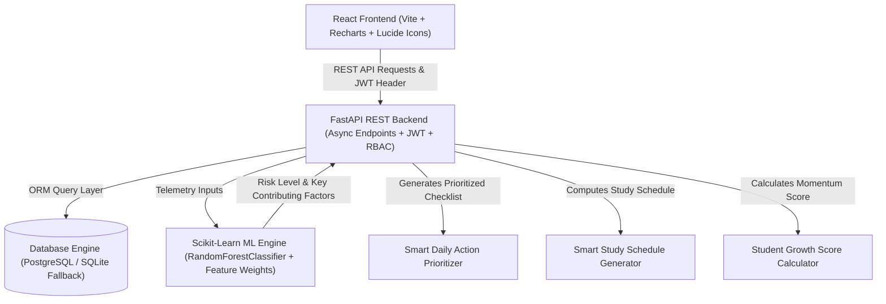

# System Architecture & Technical Specifications: CampusFlow

CampusFlow is designed as a decoupled, multi-tiered SaaS web application powered by FastAPI, Scikit-learn ML inference, SQLAlchemy ORM, and React 18 with Vite.

## Core Modules & Design Choices

### 1. RESTful API Architecture
Built with Python FastAPI, featuring automatic OpenAPI v3 documentation at `/docs`, Pydantic v2 data validation schemas, PyJWT bearer token authentication, and Passlib password hashing.

### 2. Machine Learning Pipeline
- **Algorithm**: `RandomForestClassifier` trained on a synthetic academic telemetry dataset (`ml/dataset.csv`).
- **Input Features**: `attendance_pct`, `avg_internal_marks_pct`, `assignment_completion_pct`, `previous_gpa`, `missed_assignments_count`, `study_hours_per_week`, `recent_trend_slope`.
- **Outputs**: Risk Level classification (`Low Risk`, `Medium Risk`, `High Risk`), score probability, and human-readable contributing factors callout.

### 3. Database Layer
Relational model designed for PostgreSQL with zero-dependency SQLite fallback for immediate local demonstration.

### 4. Smart Productivity Engines
- **Smart Daily Action System**: Evaluates overdue assignments, low attendance (<75%), upcoming exams (<=14 days), and internal marks to output a prioritized daily checklist.
- **Smart Study Planner**: Generates personalized exam revision schedules considering subject credits, exam date, daily available study hours, and subject preparation levels.
- **Student Growth Score**: Transparent metric tracking academic momentum (30% Attendance + 35% Marks + 25% Assignments + 10% Consistency).
