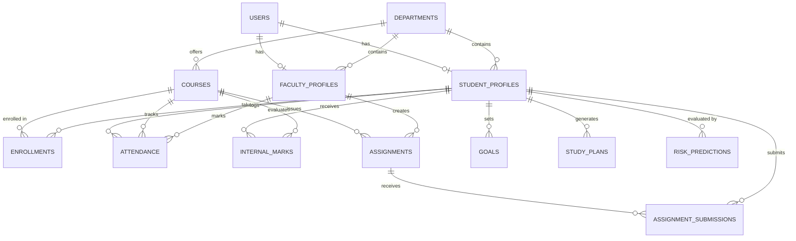

# Database Entity Relationship (ER) Diagram: CampusFlow

The CampusFlow platform employs a normalized relational PostgreSQL database schema comprising 17 entities linked via strict foreign key constraints and indexed columns.

## Entity Descriptions

1. **USERS**: Central authentication table storing email, hashed password, role (`student`, `faculty`, `admin`), and profile avatar URL.
2. **DEPARTMENTS**: Academic divisions (CSE, ECE, IT).
3. **FACULTY_PROFILES**: Faculty metadata including employee ID, designation, office hours, and department link.
4. **STUDENT_PROFILES**: Student metadata including roll number, current semester, GPA, target GPA, and cohort year.
5. **COURSES**: Course curriculum information including course code, title, department, credits, and semester level.
6. **ENROLLMENTS**: M:N student-to-course mapping with letter grades.
7. **ATTENDANCE**: Daily attendance logs marked by faculty with statuses `present`, `absent`, or `excused`.
8. **INTERNAL_MARKS**: Continuous assessment records (Mid-Terms, Quizzes, Lab Practicals) with score, max score, and percentage weightage.
9. **ASSIGNMENTS**: Course assignment specifications, due dates, and creator metadata.
10. **ASSIGNMENT_SUBMISSIONS**: Student assignment submissions with text/file content, submission timestamps, grades, and faculty feedback.
11. **RISK_PREDICTIONS**: AI ML Academic Risk assessment history storing predicted risk levels (`Low Risk`, `Medium Risk`, `High Risk`), numerical risk probability scores, and JSON key factors.
